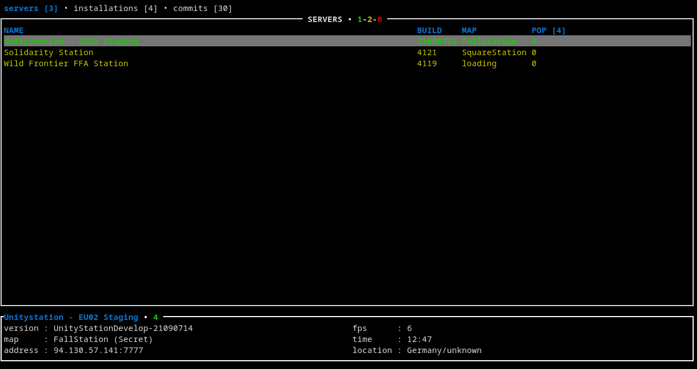
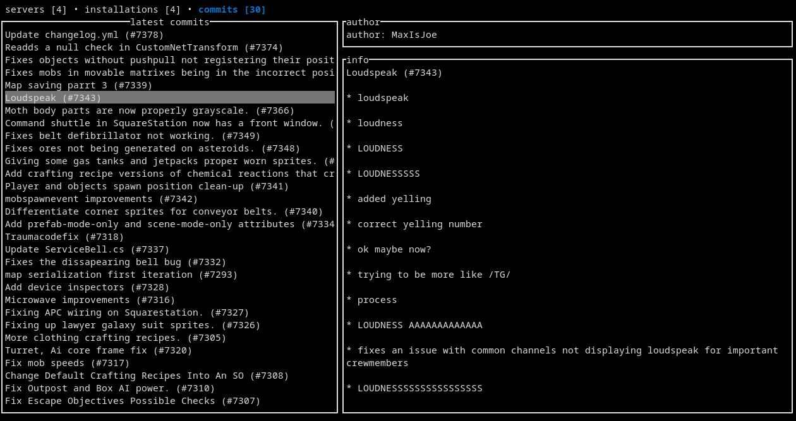
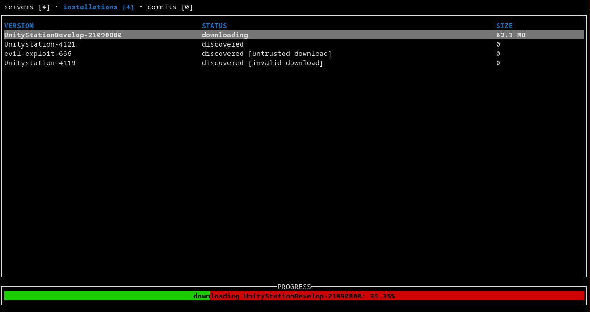
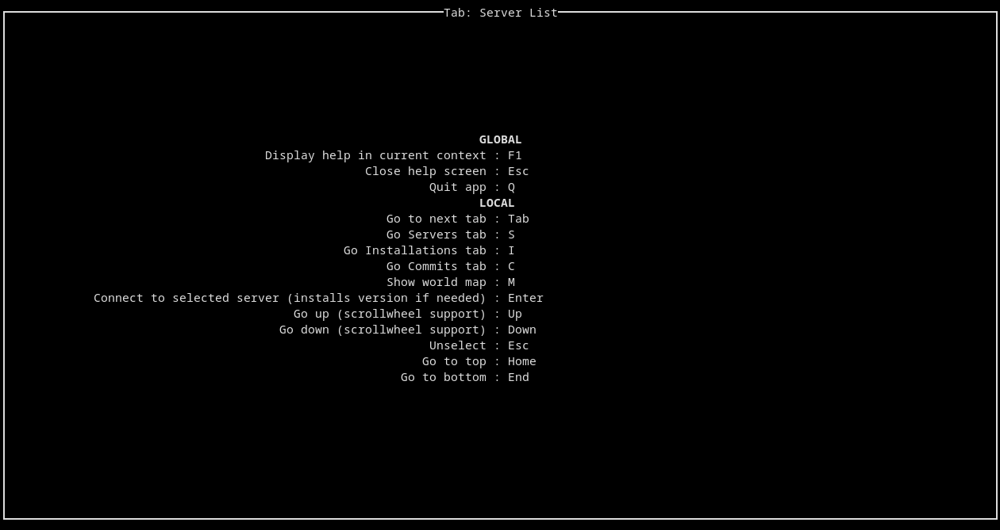
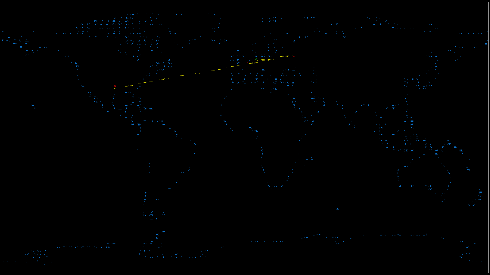

# RSHub
Unofficial game launcher for UnityStation.

RSHub is a terminal application written in Rust for listing and connecting to UnityStation game servers.
UnityStation is a modern remake of Space Station 13 in Unity.

### Feature comparison to official Hub
| feature | RSHub | StationHub |
|:---:|:---:|:---:|
| auth[1] | no | yes |
| list online servers | yes | yes |
| connect to server | yes | yes |
| ping servers | no | yes |
| manage installations (add/remove) | yes | yes |
| run local installation | yes | [broken](https://github.com/unitystation/stationhub/issues/128) |
| news/commits section | yes | yes |
| show servers on map (useless) | yes | no |
| written in rust | yes | no |
| ian icon | no | [broken](https://github.com/unitystation/stationhub/issues/111) |

[1] Even though launching game without auth has major inconveniences, described in [issues](#issues), I am not planning to support firebase (unitystation is switching to their own provider).

### Platform support
- Linux: developed and tested on.
- Windows: seem to work, though I do not have machine to test it.
- Mac: it might work, but most likely it would not because of platform limitations. I have no machine to test it.

### Installation
Prebuilt binaries can be found in [releases](https://github.com/Fogapod/rshub/releases).

RSHub requires nightly rust toolchain to build (unstable strip feature).
If you do not have nightly toolchain, you can prefix cargo commands with `RUSTC_BOOTSTRAP=1 cargo ...` as a workaround.

Install from crates.io (stable version): `cargo install rshub`  
Or with [geolocation](#geolocation) feature: `cargo install rshub --feature geolocation`

Run from source (latest version):
`cargo run` or `cargo run --release` (slow)

### Usage
- Use `--help` to get CLI usage.
- Press F1 on any screen to show hotkeys.

### Issues
There are multiple issues using RSHub currently:
- Linux, i3 specific: game starts in fullscreen in bad resolution. Solution: uncheck fullscreen mode in game settings.
- You will get auth error when connecting to server. This is because of a workaround for this bug: https://github.com/unitystation/unitystation/issues/7375
- When connecting to server, you will have to uncheck `Host Server` checkbox because of this bug: https://github.com/unitystation/unitystation/issues/7376
- When connecting to server, you will have to enter your password each time. Autologin is broken: https://github.com/unitystation/unitystation/issues/7377

### Geolocation
Currently geolocation feature (world map) is opt-in at compile time because of security cencerns.
You will have to add `--features geolocation` to cargo commands to enable it.
This is because service I use for geolocation has too high ratelimits and I had to set up my own instance.  
While solves ratelimits problem, it lets me gather IP addresses (and locations) of hub users, so I made it strictly opt-in.

### Special thanks (random order)
- PotatoAlienOf13: for testing and suggestions during initial development and original [idea](https://github.com/PotatoAlienOf13/not-station-hub)
- kalmari: for answering Rust questions
- [gitui](https://github.com/extrawurst/gitui) and [bottom](https://github.com/ClementTsang/bottom) for inspiration
- Unitystation developers for the game

### More screenshots

